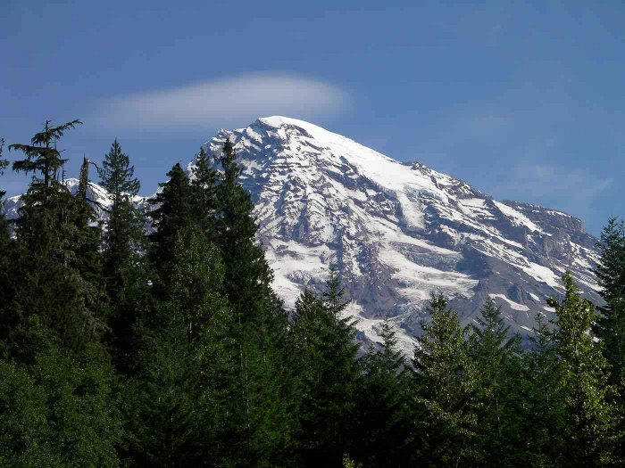
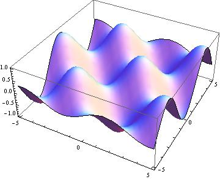
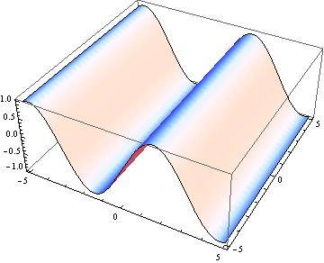
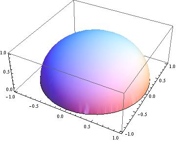

Multivariable functions
=======================

How to describe Mt. Rainier?
----------------------------

How to describe Mt. Rainier?
----------------------------

-   With poetry.
-   By height above the "ground".
-   By depth below a giant tarp hovering at constant altitude above the
    mountain.

"Assume a spherical cow...."
----------------------------

Let's approximate and say that the mountain is shaped roughly like a
paraboloid. We can peek under the mountain a bit to see the shadow it
casts:

Describe our toy mountain using numbers
---------------------------------------

For each point in the shadow, record the height of the mountain over
that point.

For our toy model, this function is $f(x,y)=9-x^2-y^2$

The general philosophy of functions still works.

-   A function takes an input and returns an output.
-   There need not be a formula. The function could be defined on weird
    inputs.
-   For example: my desire for coffee (rated as "small","medium",
    "large") is a function of my fatigue ("mild", "moderate", "extreme")
    and my rough Husky card balance ("empty", "some", "lots"). Thus,
    d(mild,lots)=small and d(extreme,some)=large, but perhaps
    d(extreme,none)=moderate. Etc.

Our toy picture is a graph
--------------------------

The shape you have recorded is the graph of a function of two variables!

In this toy model, the function is $f(x,y)=9-x^2-y^2$, so the graph
is described by $z=9-x^2-y^2$.

Take a whack at graphing these:

-   $f(x,y)=\sin(x)$
-   $f(x,y)=\sin(x)\cos(y)$
-   $f(x,y)=\sqrt{1-x^2-y^2}$

Match the graph with the function
---------------------------------

### Functions 

- $\sin(x)$
- $\sin(x)\cos(y)$
- $\sqrt{1-x^2-y^2}$

### Graphs

Enter the domain of the sheep\*
-------------------------------

\*My college roommate studied Akkadian and found this written in
Akkadian on a Pepsi can in 1999

Functions of two (or more!) variables have domains just like functions
of one variable.

Sometimes, the domain is a natural consequence of the shape of the
function.

Usually, the domain is specified in advance.

What are the natural domains of the following functions?

-   $f(x,y)=9-x^2-y^2$
-   $f(x,y)=\sin(x)+\cos(|y|+\cos(x^{2012}))$
-   $f(x,y)=\ln(x+y)$

A mountaineer cannot lift mountains
-----------------------------------

She needs to have a map, like this one, with level curves.

The level curves are horizontal traces!
---------------------------------------

Telling things apart
--------------------

»Which of these contour maps corresponds to a circular cone?

»What is the function $f(x,y)$ whose graph in the region $0\leq
z\leq 9$ is a circular cone with base radius $3$ and vertex at
$(0,0,9)$?

People really do this
---------------------

Here's a [link](http://www.nationalatlas.gov/100topos/Mt_Rainier.html)
to a map of Mt. Rainier from 1924 in the US national atlas.

What does it mean when the level curves are bunched together?

What about more variables?
--------------------------

We can plot level surfaces for functions of three variables (but it's
rather hard to visualize). Here's an example with
$f(x,y,z)=x^2+y^2+2z^2$.

