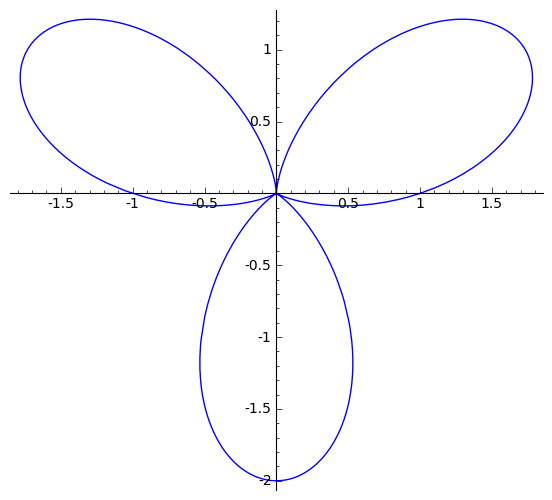

Area
====

An incredibly entertaining application of double integrals: area!
-----------------------------------------------------------------

We've been thinking about double integrals as computing volume.

They also compute area! Given a region $R$,

$$\iint_R1dA=\text{area}(R).$$

This can be useful when we can find nice coordinates.

Example
-------

Let's consider one of the marvelous polar shapes from before.

How about the area inside the curve $r=1+\sin(3\theta)$?

The integral becomes
$$\int_0^{2\pi}\int_0^{1+\sin(3\theta)}rdrd\theta$$

Evaluate it, get
$\frac{1}{2}\theta-\frac{1}{3}\cos(3\theta)+\frac{1}{24}(6\theta-\sin(6\theta))|_0^{2\pi}=\frac{3}{2}\pi$

Be careful about how path is traversed!

Do one!
-------

Consider the delightful logarithmic spiral:

$$r=e^{\theta/5}.$$

-   What is the area of the first full turn of the spiral
    ($0\leq\theta\leq 2\pi$)?
-   What is the limit of the area inside the spiral
    $r=e^{\alpha\theta}$ as $\alpha$ tends to $0$?

One more, for extra fun
-----------------------

Suppose there is a snail whose shell is built around the spiral like
this: between each point of the spiral and the center there is a circle
of shell material. Thus, the circle connecting the center to the point
with polar coordinates $(\theta,e^{\theta/5})$ has radius
$\frac{1}{2}e^{\theta/5}$ and is centered at the point with polar
coordinates $(\theta,\frac{1}{2}e^{\theta/5})$. Write down an
explicit integral that computes the volume of the shell.

Center of mass
==============

Question
--------

Nedwina enjoys eating roadkill. She has found a squashed squirrel in the
shape of the unit square centered at the origin in the $xy$-plane; its
density at a point $(x,y)$ is $e^{x+y}$. In order to cook the
squirrel correctly, Nedwina has to balance it on the top of a narrow
stick. How should she lay the flat and rigid squirrel on the stick?

Re-phrase: where is the center of mass of the flattened squirrel?

Here is a representation in which the intensity of color is proportional
to the density $e^{x+y}$.

Where do you guess the center of mass will be?

Computing center of mass
------------------------

Let's suppose we have a planar lamina $D$ with a function
$\rho(x,y)$ describing the density of the lamina at a point
$(x,y)$.

Just like in Math 125, we compute the center of mass by dividing the
moments around the $x$ and $y$ axes by the mass. In integrals, the
location $(\overline x,\overline y)$ of the center of mass will be:

$$\overline
x=\frac{\iint_Dx\rho(x,y)dA}{\iint_D\rho(x,y)dA}$$

$$\overline
y=\frac{\iint_Dy\rho(x,y)dA}{\iint_D\rho(x,y)dA}$$

In our case
-----------

Writing it out for Nedwina's squirrel:

$$\overline
x=\frac{\int_{-1/2}^{1/2}\int_{-1/2}^{1/2}xe^{x+y}dxdy}{\int_{-1/2}^{1/2}\int_{-1/2}^{1/2}e^{x+y}dxdy}=\frac{3-e}{2e-2}$$

$$\overline
y=\frac{\int_{-1/2}^{1/2}\int_{-1/2}^{1/2}ye^{x+y}dxdy}{\int_{-1/2}^{1/2}\int_{-1/2}^{1/2}e^{x+y}dxdy}=\frac{3-e}{2e-2}$$

*Yum!*
------

Do one!
-------

A steam roller comes by and runs over the squirrel. The poor thing now
occupies the square $[-1,1]\times[-1,1]$ with density function
$\rho(x,y)=\alpha e^{x+y}$ (where $\alpha$ is a constant that
keeps the total mass constant; find it if you feel like it).

-   What is the new center of mass?
-   Suppose this procedure repeats so that the $n$th time the steam
    roller runs over the squirrel the square becomes
    $[-2+e^{-n},2-e^{-n}]\times [-2+e^{-n},2-e^{-n}]$ and the
    density becomes $\rho(x,y)=\alpha_n e^{x/n+y/n}$ (for an
    appropriate constant $\alpha_n$ to keep the mass constant). What
    is the limiting position of the center of mass as $n\to\infty$?

